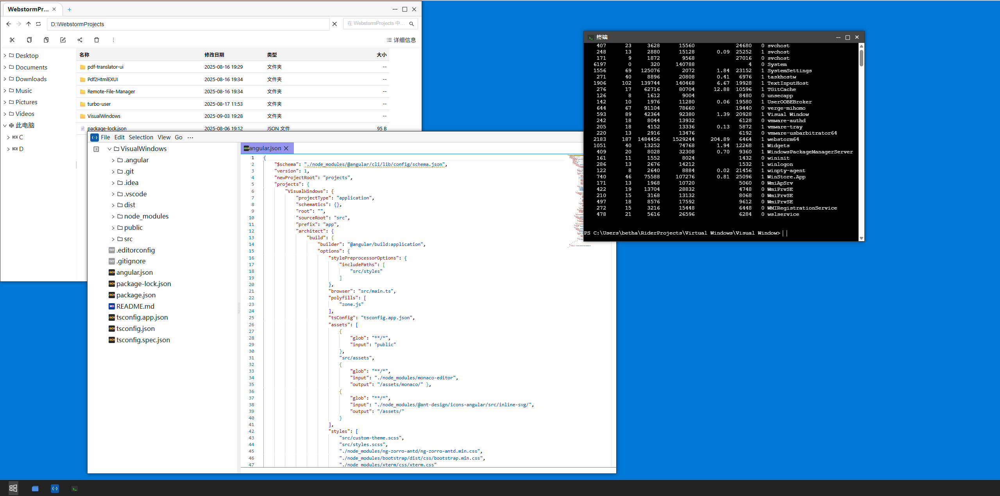

## VisualWindows
尝试通过Angular + C# 构建现代化服务器管理桌面。  
当前预览图片。


## 已经实现的程序或功能
- 支持windows和ubuntu
- 程序的显示逻辑
- 不太完善的程序
  - 终端
  - 文件浏览器（文件的复制，剪切，等操作均还未实现）
  - 图片查看器
  - 代码查看器
- 深度耦合的关联程序设计


## 会慢慢实现的程序或功能
- 优雅的文件处理工具（复制，粘贴，剪切等）
- docker管理程序
- nginx管理程序
- ssl证书管理程序
- 进程管理器
- 反向代理管理器
- 优化的代码查看器
- 优雅的桌面
- 更好的移动端支持
- 支持更多系统
- 国际化

# 运行指南
## 本地调试


下载后端代码并构建运行(后端使用.net 9)  
在 ubuntu server / desktop 上要使用终端,需要在启动服务程序前执行
```bash
export DOTNET_EnableWriteXorExecute=0
```
[visual-windows-server](https://github.com/nanaminato/visual-windows-server)

修改 `src/environments/environment.ts`文件的内容，使其指向后端提供程序。
### 调试运行
```bash
ng serve
```


### 构建

```bash
ng build
```
